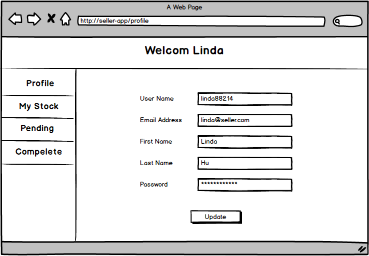

# Seller App Proposal 

## User Story

##### I would like to update the stock availabilities. 
- Need Stocks table
- User can create a new item 
- User can update current item 
- User can delete the item
- Need to have different pages

##### When the customer order, I want to see the items so I can prepare for the delivery.
- Need Pending-order table
- Need Order page 
- Need 'GET'
- Need 'POST'
- Need to show the order item number, buyer name, and how many items were placed 

##### When the customer order, I want to check the items availability. 
- Inside the Stock page, the user can check the items availability by searching with item number

##### When I'm done with preparing the package, I would like to change the status in the system. 
- Inside the Order page, the user can change the status by clicking button
- Need to have 'Pending', 'Complete' buttons to change the status 
- When the button is clicked, the person's name needs to be updated below the status 
- Need 'PUT' to update the status 
- Need 'DELETE' to remove from the Pending-order table

##### I would like to keep all the completed order records. 
- Need the Completed order page
- Need Completed-order table
- When the order status is set to 'Complete', the order record stores inside the Completed order page
- Need 'GET' method from the completed order table
- When the user clicks on the each order, user can see the ordered items 

##### Need log in page to secure the orders
- Need Sign-up, Log-in page, profile page
- Need auth 
- Need users table 
- User can update the profile 

 

## CRUD

| CRUD | METHOD | NEED FOR |
|    :---:   | :---:  | :---:      |
| **CREAT**  | POST   | User, Item |
| **READ**   | GET    | Stock page, Pending order page, Completed order page |
| **UPDATE** | PUT    | User, Stock page, Pending order page |
| **DELETE** | DELETE | User, Stock page, Pending order page |

 

## Pages Need 

- Sign-up Page
- Log-in Page 
- User Profile Page
- Stock Show page 
- Stock Update/Delete page
- Pending Order page 
- Completed order page 

 

## Table Need 

#### User Table

| user-id | username   | first-name | last-name | email            | password |
| :---:   | :---:      | :---:      | :---:     | :---:            | :---:    |
| 1       | linda88214 | Linda      | Hu        | linda@seller.com | *******  |

#### Stock Table

| stock-id | item-name | item-number | description             | price  | stock |
| :---:    | :---:     | :---:       | :---:                   | :---:  | :---: |
| 1        | Black Hat | BLH012984   | Novelty Black Derby Hat | $20.99 | 29    |

#### Pending Order Table

| order-id | order-number | buyer | items-number| total  | status |
| :---:    | :---:        | :---: | :---:       | :---:  | :---:  |
| 1        | on000001     | Ellen | BLH012984   | $20.99 | Pending| 

#### Complete Order Table 

|complete-date | order-number | buyer | total | 
| :---:        | :---:        | :---: | :---: |
| 03/08/2018   | on000001     | Ellen | $20.99|

 
 

## Wireframe 

 

## Timeline 

##### 03/08/2018 Thursday 
- Proposal
- Wireframe 

##### 03/09/2018 Friday 
- Set up project file 
- Build and seed database 

##### 03/10/2018 Saturday 
- Build CRUD with rails (routes, controllers, models)
- Build Components with react for each page (routes)

##### 03/11/2018 Sunday 
- Create Sign up page and Log in page
- Create a form and test
- CSS work 

##### 03/12/2018 Monday 
- Create Stock show, update/delete page
- Work on Search bar 
- CSS work 

##### 03/13/2018 Tuesday 
- Create Pending page
- Work on each show, update and delete 
- CSS work 

##### 03/14/2018 Wednesday 
- Create Complete page
- CSS work 

##### 03/15/2018 Thursday 
- Testing 
- Styling Fix 

##### 03/16/2018 Friday 
- SCIENCE FAIR 

 

## Technologies 
React.js, Ruby on Rails, Postgresql, HTML, CSS, Flexbox 

