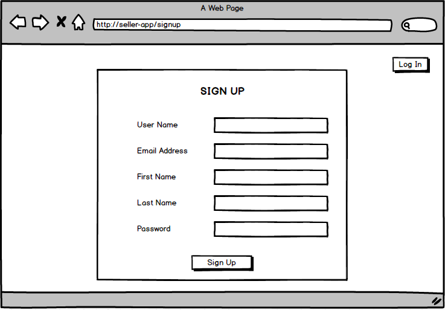
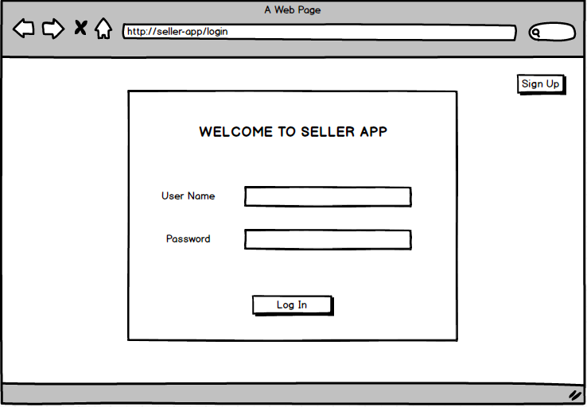

# Seller App

### Proposal 

## User Story & MVP

###### I would like to update the stock availabilities. 
- Need Stocks table
- Need CRUD 
- Need to have different pages for each CRUD 

###### When the customer order, I want to see the items so I can prepare for the delivery.
- Need Pending-order table
- Need Order page 
- Need 'GET'
- Need 'POST'
- Need to show the order item number and how many items were placed 

###### When the customer order, I want to check the items availability. 
- Inside the Stock page, the admin can check the items availability by searching with item number

###### When I'm done with preparing the package, I would like to change the status in the system. 
- Inside the Order page, the admin can change the status by clicking button
- Need to have 'Pending', 'Complete' buttons to change the status 
- When the button is clicked, the person's name needs to be updated below the status 
- Need 'PUT' to update the status 
- Need 'DELETE' to remove from the Pending-order table

###### I would like to keep all the completed order records. 
- Need the Completed order page
- Need Completed-order table
- When the order status is set to 'Complete', the order record stores inside the Completed order page
- Need 'GET' method from the completed order table

###### Need log in page to secure the orders
- Need Sign-up, Log-in page
- Need auth 
- Need users table 

## CRUD

| CRUD | METHOD | NEED FOR |
|    :---:   | :---:  | :---:      |
| **CREAT**  | POST   | User, Item |
| **READ**   | GET    | Stock page, Pending order page, Completed order page |
| **UPDATE** | PUT    | User, Stock page, Pending order page |
| **DELETE** | DELETE | User, Stock page, Pending order page |

## Pages Need 

- Sign-up Page
- Log-in Page 
- User Profile Page
- Stock Show page 
- Stock Update/Delete page
- Pending Order page 
- Completed order page 

## Table Need 
- Users table 
- Stocks table 
- Pending order table 
- Complete order table 

One user has many Completed order 
One pending order has many items in stocks table 

## Wireframe 

## Timeline 

##### 03/08/2018 Thursday 
- Proposal
- Wireframe 

##### 03/09/2018 Friday 
- Set up project file 
- Install rails for back-end 
- Install react for front-end 
- Build and seed database 

##### 03/10/2018 Saturday 
- Build CRUD with rails 
- Build Components with react for each page 

##### 03/11/2018 Sunday 
- Create Sign up page and Log in page
- Create a form and test
- CSS work 

##### 03/12/2018 Monday 
- Create Stock show, update/delete page
- Work on Search bar 
- CSS work 

##### 03/13/2018 Tuesday 
- Create Pending page
- Work on each show, update and delete 
- CSS work 

##### 03/14/2018 Wednesday 
- Create Complete page
- CSS work 

##### 03/15/2018 Thursday 
- Testing 
- Styling Fix 

##### 03/16/2018 Friday 
- SCIENCE FAIR 

